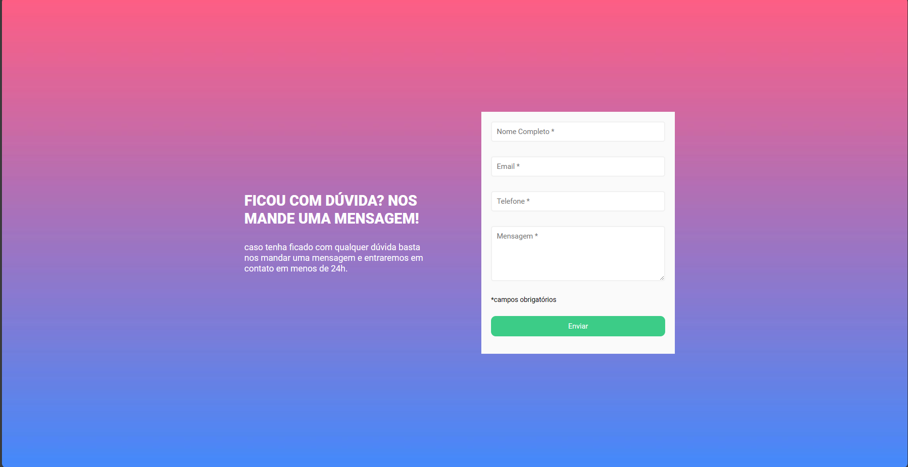

# Meu Primeiro Projeto HTML, CSS e JavaScript

Este é o meu primeiro projeto usando HTML, CSS e JavaScript. É um formulário de contato simples que utiliza essas três tecnologias para criar uma experiência interativa na web.



## Introdução

Este projeto foi criado como parte do meu aprendizado inicial em programação web. Ele demonstra o uso básico de HTML para estruturar a página, CSS para estilizá-la e JavaScript para adicionar funcionalidade de validação de formulário.

## Como Usar

1. Clone este repositório para o seu sistema local:

   ```bash
   git clone https://github.com/seu-usuario/meu-primeiro-projeto-html-css-js.git


2. Navegue até o diretório do projeto:
    ```
    cd meu-primeiro-projeto-html-css-js

3. Abra o arquivo index.html em seu navegador da web para visualizar o formulário.

    ### Funcionalidades
    O formulário possui campos de nome e email, com validação de preenchimento obrigatório.
    Mensagens de erro são exibidas se os campos não forem preenchidos.
    O projeto inclui estilos de CSS para torná-lo visualmente atraente.
    JavaScript é usado para adicionar interatividade ao formulário.

    ### Aprendizado
    Este projeto foi uma ótima maneira de iniciar minha jornada na programação web. Aprendi:

    - Como estruturar uma página web com HTML.
    - Como aplicar estilos e layouts usando CSS.
    - Como adicionar comportamento interativo com JavaScript.
    - Conceitos básicos de validação de formulários.

    ### Próximos Passos
    Embora este seja apenas o começo, estou animado para continuar a explorar e aprender mais sobre o desenvolvimento web. Alguns dos meus próximos passos incluem:

    - Aprofundar meu conhecimento em HTML, CSS e JavaScript.
    - Explorar frameworks e bibliotecas populares, como React, Vue.js e Bootstrap.
    - Criar projetos mais complexos e desafiadores.
    ### Contribuição
    Sinta-se à vontade para contribuir ou dar sugestões para melhorar este projeto. Estou aberto a aprender com a comunidade e tornar este projeto ainda melhor!

    Feito com ❤️ por Thiagobt03
    ```
    https://github.com/Thiagobt03
